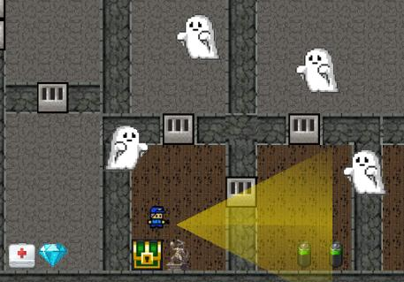
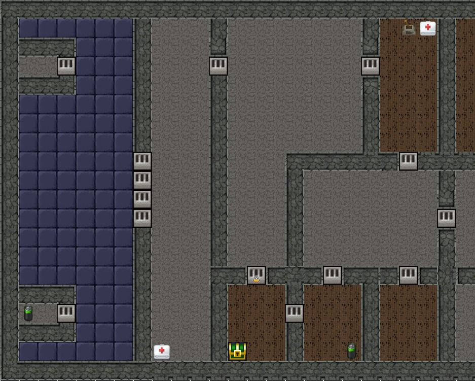

# GameHackIIII
A game written on python3 whoes main goal is to escape from a night museum while killing all the ghosts with your flashlight

[presentation](https://docs.google.com/presentation/d/1oJaUjk3Vsv4NscC-sAx0RQISZJrTZ-AJbf67UjYwpxE/edit?usp=sharing)








## Requirements
```
  pip install numpy pygame
```

## Executing
```
  python3 main.py
```
